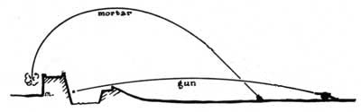

<h1 align="center">
Player Name Render Changes & AI Tracking
</h1>

Most likely the most comprehensive alteration which 
_By Iron or Fire_
makes to vanilla Minecraft is the changes to both player visibility and AI tracking.

Player Visibility is a fairly straight forward matter.
_By Iron or Fire_
Checks the currently equipped armor sets, should any be present,
and adjusts the visibility of said players nameplate accordingly. The values used to determine a nameplates visibility
are also used in rework of mob AI and tracking. If a player can see you, so can Mobs, and vice versa. This coincides with a
Priority system for tracking. No longer will hostile Mobs simply look for the closest person, 
they will prioritize the weakest visible person to them. This means that wearing leather armor has its strengths and weaknesses.
On one end you are less likely to be tracked by hostile mobs, allowing players to slip right past them, but when they do spot you they will prioritize you over all others

***__(To Be Expanded)__***

---
<h1 align="center">
Chained Armors
</h1>

Chained armors act as nice a middle ground between their respective parent armor's, and the
tier above them. They offer an extra level of protection at a given armor tier which would otherwise be impossible to obtain.
The downsides to this added protection is greater player visibility and AI tracking, mentioned above.

***__(To Be Expanded)__***

---
<h1 align="center">
Attached Elytras
</h1>

In order to balance out armors & their use within Minecraft's gameplay loops Elytras need to be addressed. 
Attached Elytras aims to tackle just that offering a compromise between protection and flight, 
allowing Elytras to be attached to both Leather, and Chained Leather, Tunics.
this offers a modest level of protection for the player, as well as, granting access to more player expression
through the dyeable nature of leather armor. The trade off for these benefits is "added weight" which results in both
lower flight distance, _(The distance at which a single firework rocket will propel the player)_,
and faster acceleration to terminal velocity, _(The distance needed to fall to reach maximum player damage)_.

***__(To Be Expanded)__***

---
<h1 align="center">
Smithing Table Rework
</h1>

The way in which the Smithing Table was implemented has always bothered me. In its current state, an excellent opportunity was missed to expand upon the armor system itself.

***__(To Be Expanded)__***

---
<h1 align="center">
Mortars & Bombs
</h1>

An area denial weapon, Mortars offer the player a litany of alternatives for engaging combat that both the bow and crossbow cannot offer. 
Fist and for most, both the mortar and hand mortar fire bombs not shells. These are inaccurate but rather appropriate deal area damage.
Furthermore, the bombs themselves follow a similar convention to vanilla firework rockets and can be modified with potions
and other items to grant unique effects. Mortars themselves are quite powerful but there extended reload,
twice that of the crossbow, and priming time, the time it takes for the projectile to arm, directly limit there role to niche cases.

<h6>
Difference between a mortar and a gun
</h6>

***__(To Be Expanded)__***

---

### A Comprehensive (and highly uncertain) Breakdown can be found at the:
#### [By Iron or Fire Trello](https://trello.com/b/XMMYLNES/by-iron-or-fire)
