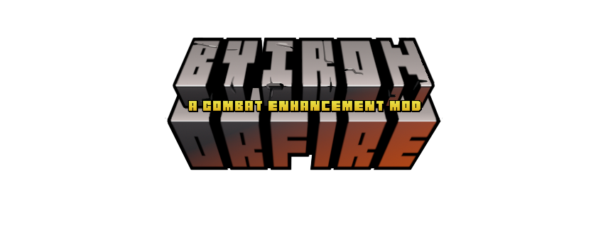

<h1 align="center">
Player Name Render Changes & AI Tracking
</h1>

Most likely the most comprehensive alteration which 
_By Iron or Fire_
makes to vanilla Minecraft is the changes to both player visibility and AI tracking.

Player Visibility is a fairly straight forward matter.
_By Iron or Fire_
Checks the currently equipped armor sets, should any be present,
and adjusts the visibility of said players name plate respectively.

***__(To Be Expanded)__***

---
<h1 align="center">
Chained Armors
</h1>

Chained armors act as nice a middle ground between their respective parent armor's, and the
tier above them. They offer an extra level of protection at a given armor tier which would otherwise be impossible to obtain.

***__(To Be Expanded)__***

---
<h1 align="center">
Attached Elytra's
</h1>

In order to balance out armors & their use within Minecraft's gameplay loops Elytra's need to be addressed. 
Attached Elytra's aims to tackle just that offering a compromise between protection and flight, 
allowing Elytra's to be attached to both Leather, and Chained Leather, Tunics.
this offers a modest level of protection for the player, as well as, granting access to more player expression
through the dyeable nature of leather armor. The trade off for these benefits is "added weight" which results in both
lower flight distance, _(The distance at which a single firework rocket will propel the player)_,
and faster acceleration to terminal velocity, _(The distance needed to fall to reach maximum player damage)_.

***__(To Be Expanded)__***

---
<h1 align="center">
Smithing Table Rework
</h1>

The way in which the Smithing Table was implemented has always bothered me. In its current state, an excellent opportunity was missed.

***__(To Be Expanded)__***

---

### A Comprehensive (and highly uncertain) Breakdown can be found at the:
#### [By Iron or Fire Trello](https://trello.com/b/XMMYLNES/by-iron-or-fire)
